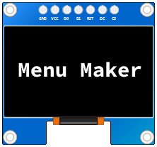
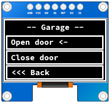

<center>

</center>

# Easy creating menus for SH1106.

* **Fast but not secure**. There are no additional checks in the source code, so the code runs quickly. All responsibility for entering incorrect data lies with the user.
* **Easy**. All you need to do is add scenes, buttons and set callbacks.
* **Nesting of scenes**. Button callbacks can be used as transition to another scenes.
* **Custom energy consumption**. With setUpdateTimeMS method refresh screen rate can be castomized.

# How to use?

**1. Install U8glib in Library Manager.**
<center>

</center>

**2. Connect OLED to Arduino.**
<center>

</center>

**3. Copy source code with good example in main.ino:**
```c++
// Include main lib file
#include "MenuMaker.h"

void setup(void) {
  Serial.begin(9600);

  // Init display size
  MenuMaker::Instance()->init( 123, 62 );

  // Create your own scene
  Scene* createdScene = MenuMaker::Instance()->createScene( "Garage" );

  // Add buttons to this scene
  createdScene->addButton( "Open door", 
    [](){ Serial.print( "Door opened" ); } );
    
  createdScene->addButton( "Close door", 
    [](){ Serial.print( "Door closed" ); } );
    
  createdScene->addButton( "<<< Back", 
    [](){ Serial.print( "To Previous menu" ); } );

  // Display this or another scene
  MenuMaker::Instance()->showScene( "Garage" );

  // Refresh screen rate (MS)
  MenuMaker::Instance()->setUpdateTimeMS( 2000 );

  // Call cursorUp and cursorDown methoods to move cursor
  createdScene->cursorDown();

  // Current button callback
  createdScene->pressCurrentButton();
}

void loop(void) {
  // Menu maker update
  MenuMaker::Instance()->update(millis());
}
```

**Result of the example:**
<center>

</center>
